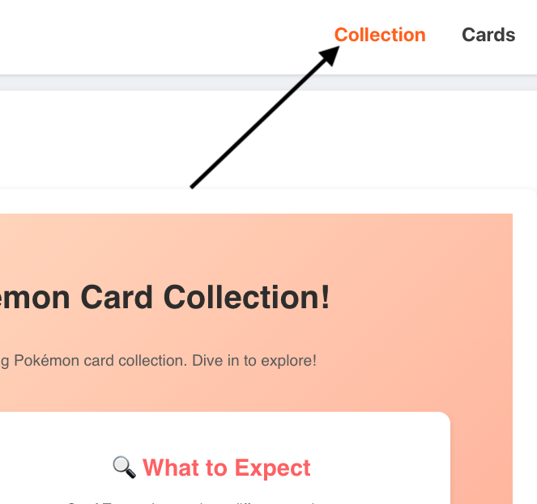
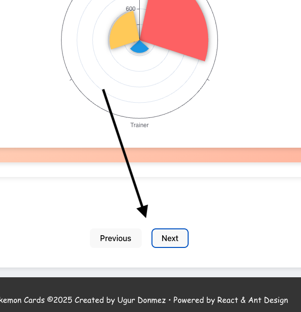
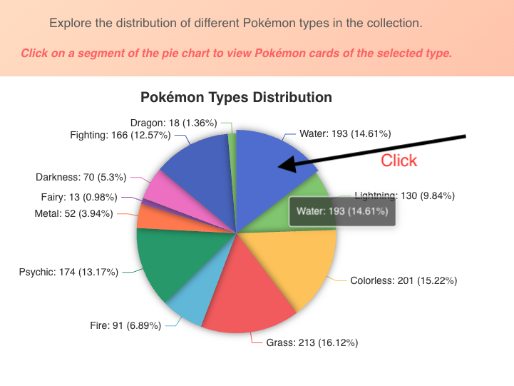
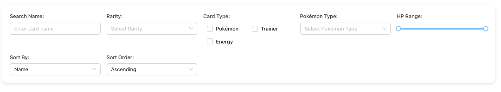
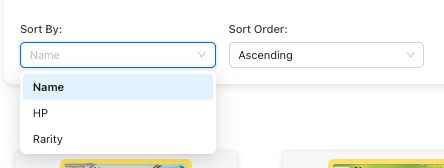
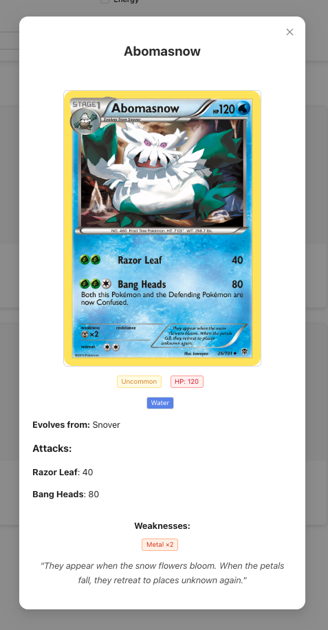
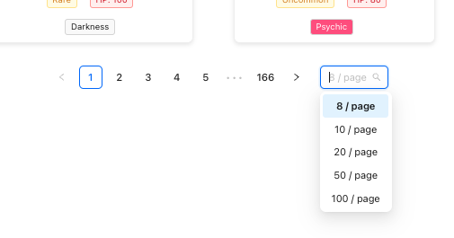

# Pokémon Card Collection

A web application for exploring Pokémon cards, their details, and distributions. Built with modern web technologies, this project provides an interactive and visually rich experience.

---

## Deployment

This project is hosted on **GitHub Pages**. You can access the live version of the application here:

👉 [Pokémon Card Collection](https://ugurdonmez.github.io/pokemon-card-collection)

### Development Notes for GitHub Pages
1. The app is deployed to the `gh-pages` branch via GitHub Actions.
2. Make sure the `homepage` field in `package.json` is set to:

---


## Notes on Chart and Filtering Features

In my experience, it is crucial to provide the ability to share charts and filtering states. This feature allows users to easily:

- Share specific charts or filtered results via platforms like **Slack**.
- Add direct links to specific filters or charts in documentation tools like **Confluence** or other collaborative platforms.

### Implementation
This capability has been carefully considered and implemented during development to ensure:
- **Deep Linking**: Charts and filtering states are reflected in the URL, making them sharable.
- **Reproducibility**: Shared links always lead to the same filtered data or chart view, ensuring consistency.

This makes the application not just a tool for exploration but also a resource for collaboration and documentation within teams.

---


## Features

1. **Interactive Presentation**:
   - You can start a small presentation under the "Collection" section in the header (requires manual navigation).

    

2. **Chart Navigation**:
   - After exploring each chart, you can click the **Next** button to proceed to the next section.
   - You can navigate back using the **Previous** button or the browser's back button.

   

3. **Interactive Chart Filtering**:
   - Click on any portion of a chart to navigate to the card section, which will be pre-filtered based on your selection.
   - For example:
     - Clicking "Water" in the Pokémon Types Distribution chart will display all water Pokémon cards owned by Ash.

    

4. **Card Filtering Options**:
   - Filter cards based on different criteria, such as rarity, type, and HP range.

    

5. **Search Functionality**:
   - Search for specific Pokémon cards by name.

6. **Sorting Options**:
   - Sort cards by:
     - **Name**
     - **HP**
     - **Rarity**
   - Sorting can be done in **ascending** or **descending** order.

    


7. **Card Details**:
   - Click on any card to view detailed information about it in a modal.

    


8. **Pagination**:
   - Navigate through the card list using pagination at the bottom of the page.

    

---


These features make the application intuitive and user-friendly, offering a seamless way to explore Ash's Pokémon card collection interactively!

---


## Prerequisites

Before starting, ensure you have the following installed:

- **Node.js**: v23+ (for `yarn` to work properly)
- **Yarn**: Latest stable version
- **Docker**: If you prefer containerized deployment
- **Git**: To clone the repository 

---


## Technologies Used

- **React**: UI framework
- **Ant Design**: Component library for UI
- **ECharts**: Visualization library for data visualization
- **TypeScript**: Static typing
- **Docker**: Containerized deployment
- **Vite**: Development build tool for faster builds
- **CSS Modules**: Scoped CSS for styling

---

## How to Start

### Option 1 (Recommended): Local Development
1. Install dependencies:
   ```bash
   yarn
    ```
2. Start the development server:
   ```bash
   yarn dev
    ``` 

3. Open your browser and navigate to:
   ```bash
   http://localhost:5173/pokemon-card-collection/
    ``` 

### Option 2: Docker Standalone
1. Build the Docker image:
   ```bash
   docker build -t pokemon-card-collection .
    ```
2. Run the container:
   ```bash
   docker run -p 80:80 pokemon-card-collection
    ``` 

3. Open your browser and navigate to:
   ```bash
   http://localhost/pokemon-card-collection/
    ``` 

### Option 2: Docker Compose
1. Build the Docker image using Docker Compose:
   ```bash
   docker-compose build
    ```
2. Run the Docker image using Docker Compose:
   ```bash
   docker run -p 80:80 pokemon-card-collection
    ``` 

3. Open your browser and navigate to:
   ```bash
   http://localhost/pokemon-card-collection/
    ``` 

## Future Work

### UI Enhancements
- **Better UI**: Improve the overall look and feel.
- **Responsive Design**: Currently optimized for wide screens (1600px width). Needs adjustments for smaller screens.
- **Custom or Ant Design**: Finalize between fully custom styles or sticking to Ant Design. (Would have used Tailwind if more time was available.)
- **Fix Chart Issues**: Address spacing issues, such as in `RaritySection.tsx`.

### Functionality Improvements
- **Filter Fixes**: Resolve filtering issues, e.g., cannot filter to "Energy" in the card list.
- **Boxplot Navigation Error**: Fix the navigation bug in the boxplot section.

### Technical Updates
- **Linting**: Add or fix the linter configuration.
- **Better Typing**: Improve TypeScript typing across the project.
- **Fix Path Imports**: Normalize imports (e.g., `@` vs `.`).
- **Inline CSS**: Minimize and fix instances of inline CSS.
- **Unit Test**: Add more unit tests

### Deployment
- **GitHub Actions**: Automate deployment to GitHub Pages on commits to `main`.
- **SEO Updates**: Update meta information for better search engine optimization.
- **nginx**: Fix nginx redirect issue.

---

## References
- **ECharts Examples**: [ECharts Examples](https://echarts.apache.org/examples/en/)
- **ECharts Options**: [ECharts Options Documentation](https://echarts.apache.org/en/option.html#title)
- **Ant Desing**: [Ant Desing](https://ant.design/docs/react/getting-started)
- **Vite**: [Vite](https://vite.dev/guide/)


---

## License
This project is licensed under the MIT License.